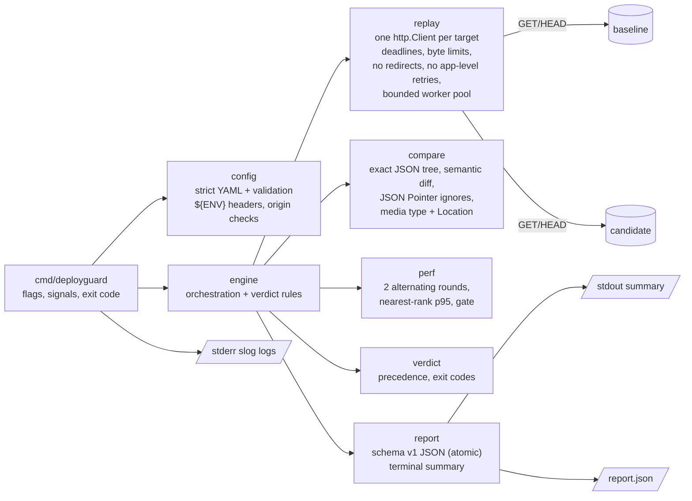

# DeployGuard architecture

DeployGuard is one Go binary with no services, database or background workers. A run is a pure function of three inputs: the workload, the two origins, and what those origins return. Its output is a report and an exit code.

## Execution flow

1. **Parse and validate inputs** (`cmd/deployguard`, `config`). Flags are parsed, and both origins are checked (`http(s)`, no userinfo, path, query or fragment) and must not be equivalent after normalization (`config.EquivalentOrigins`: scheme, case-insensitive hostname, effective port; no DNS). The workload is decoded strictly with `go.yaml.in/yaml/v3` (`KnownFields`, duplicate-key rejection, one document) and validated field by field. Header `${ENV}` references are resolved now, so a missing secret fails before any traffic. Any problem exits `3`.
2. **Functional phase** (`engine.observe`, `replay`). Scenarios run in parallel through `replay.ForEach`, which keeps at most `settings.concurrency` scenarios in flight. Within a scenario, four requests run sequentially in the order baseline, candidate, baseline, candidate. Each request has its own context deadline, a bounded body read (`max_response_bytes + 1` to detect overflow), no redirect following and no application-level retry. (Go's `net/http` Transport may itself retry an idempotent GET/HEAD after a network error on a previously used keep-alive connection; one `Target.Do` is one logical exchange, and `issued_requests` counts those, not wire attempts.) Transport errors are classified (`timeout`, `dns`, `tls`, `connection_refused`, `connection_reset`, `network`, `body_limit`, `canceled`).
3. **Behavioral verdict** (`engine.Evaluate`, `compare`). A pure function of the four observations: baseline health, then baseline stability, then candidate health, then candidate stability, then baseline/candidate comparison. It records ignore-rule usage and the reason any rule went unused.
4. **Performance phase** (`perf.Measure`). For each scenario with a performance policy whose behavior is PASS or WARN, one scenario at a time: round 1 runs baseline then candidate, round 2 runs candidate then baseline. Each target block is warm-up followed by N measured attempts at fixed concurrency, and the two targets are never loaded together. Rounds are classified (`ok`, `breach`, `candidate_errors`, `baseline_errors`, `incomplete`) and `perf.Decide` applies the gate.
5. **Final outcome** (`engine.Run`, `verdict`). Each scenario's outcome is the worst of its behavior and performance results (`SKIPPED` ignored). The run outcome is the worst across scenarios, ordered FAIL > INCONCLUSIVE > WARN > PASS. A canceled run is at least INCONCLUSIVE and exits `130`.
6. **Output** (`report`). The terminal summary goes to stdout, and the JSON report is written atomically (temporary file, then rename) *before* the process exits. A write failure becomes exit `3` with a conspicuous `ERROR:`.

## Package responsibilities

| Package | Responsibility | Depends on |
|---|---|---|
| `cmd/deployguard` | CLI surface, help text, signal handling, logger setup, exit codes | config, engine, report, verdict |
| `internal/config` | Versioned schema, strict decoding, limits and defaults, path, pointer and origin validation, `${ENV}` header interpolation with redaction | verdict, yaml |
| `internal/replay` | URL construction, a single exchange (`Target.Do`), failure classification, `ForEach` bounded pool | config |
| `internal/compare` | Exact JSON parser, canonical numbers, RFC 6901 lookup, semantic diff, ignore suppression, media type and Location normalization, opaque-body digest | verdict |
| `internal/perf` | Measurement blocks and rounds, nearest-rank percentiles, round classification, decision | config, replay, verdict |
| `internal/engine` | Orchestration, interleaved observations, behavioral rules, ignore-rule accounting, final reasons | all of the above |
| `internal/verdict` | Outcome type, precedence, exit-code mapping | none |
| `internal/report` | Report schema v1, atomic writer, ASCII terminal renderer | compare, perf, replay, verdict |
| `internal/fixture` | Demo API with seeded cases (test and demo only) | none |
| `internal/eval` | Seeded cases with ground truth, run through `engine.Run` | config, engine, fixture, report |

The verdict rules (`engine.Evaluate`, `perf.Round.Classify`, `perf.Decide`) are pure functions, so most of the decision logic is tested without a network. Network behavior is tested separately with `httptest` servers. Dependency injection is limited to what tests need: `config.LookupFunc` for environment variables, and an optional logger. There are no interfaces for their own sake.

## Important design decisions

- **Origins on the command line, workload in a file.** The workload is portable and reviewable, and cannot carry a production URL by accident. Scenario paths cannot name a host, and request URLs are assembled field by field and re-checked against the origin.
- **Untrustworthy baselines produce INCONCLUSIVE, never PASS.** A 5xx, timeout, malformed JSON or instability on the baseline means there is no reference to compare against. Treating "both sides return 500" as PASS would approve a broken release.
- **Two interleaved functional observations per target.** This is the cheapest check that separates "the field is volatile" from "the candidate changed it." Instability is reported as such, rather than as a confusing value difference.
- **Ignore rules cannot weaken structure.** Suppression happens only at the scalar comparison step in the diff walk, after type equality has been established. Removals, additions, type changes, subtrees and array lengths are decided before an ignore rule is consulted. Unused rules are reported.
- **An exact JSON model instead of `encoding/json` into `any`.** Decoding into `any` loses numeric precision (`float64`), silently accepts duplicate keys, and cannot distinguish `1` from `1.0` precisely. The token-based parser keeps numbers as canonical decimal strings.
- **No redirects, no application-level retries.** A redirect is an observable behavior to compare. A retry loop would hide exactly the intermittent failures a release gate should surface. Connection reuse is kept for realistic latency, which means accepting `net/http`'s narrow transport-level retry of idempotent requests on reused connections. That retry can absorb some connection-level failures; it is documented rather than worked around with a custom HTTP stack.
- **The finding cap never changes the verdict.** The comparator counts every difference by severity and derives the outcome from those counts. Only the retained list is capped (100), and FAIL findings displace WARN findings once the cap is reached.
- **Reports redact query values.** The report keeps query parameter names and multiplicity but replaces values, since reports travel as CI artifacts. URL paths are not redacted.
- **The latency gate requires both thresholds and repetition.** Relative thresholds alone fire on sub-millisecond noise, and absolute thresholds alone ignore scale. One breaching round is a WARN; only a repeated breach can block. Candidate errors are never smoothed over by judging the successful subset.
- **Findings without values.** Reports and CI logs are widely shared, so findings carry paths, categories, JSON types, sizes and digests. This trades debugging convenience for privacy by default.
- **Standard library first.** `net/http`, `flag`, `log/slog`, `encoding/json`, `testing` and `httptest` cover everything. The only dependency is the YAML parser.

## Failure handling

| Failure | Where it is detected | Result |
|---|---|---|
| Invalid flags, origin or workload, or missing `${ENV}` | CLI and `config` before any request | exit 3, field-specific message, no request sent |
| Baseline and candidate are the same origin (after normalization) | CLI, before loading the workload | exit 3, no request sent |
| Workload plans more than `max_total_requests` | `config` | exit 3 |
| Timeout, DNS, TLS, refused, reset or network error | `replay.classify` | typed `error` on the observation; baseline: INCONCLUSIVE; candidate: FAIL |
| Response body over `max_response_bytes` | `replay.Target.Do` | `body_limit` failure (same rules) |
| Declared JSON that does not parse | `compare.Observe` | baseline: INCONCLUSIVE; candidate: FAIL |
| 5xx | `engine.check` | baseline: INCONCLUSIVE (even if the candidate matches); candidate: FAIL |
| `expect_status` violated | `engine.check` | baseline: INCONCLUSIVE; candidate: FAIL |
| Baseline or candidate observations disagree | `engine.Evaluate` | INCONCLUSIVE or FAIL, with the differing paths |
| Errors during latency measurement | `perf.runBlock` / `Classify` | baseline: INCONCLUSIVE; candidate: errored round. Gate only if candidate errors occur in every round; errors in one round plus a latency breach in the other is a WARN ("mixed signals"), as is a single bad round |
| More than 100 differences in one comparison | `compare.differ.add` | all counted by severity; verdict from the counts; 100 retained (FAIL preferred), the rest counted as omitted |
| Ctrl+C / SIGTERM | `signal.NotifyContext` -> context cancellation | in-flight requests canceled, workers joined (`ForEach` waits), unfinished scenarios INCONCLUSIVE, report written, exit 130 |
| Report cannot be written | `report.Write` | conspicuous `ERROR:` on stderr, exit 3 regardless of the verdict |

Logs are written with `log/slog` to stderr and carry `run_id`, `phase` (`functional` or `performance`) and `scenario` attributes, plus phase durations and request counts that help diagnose the runner itself. Request headers and bodies are never logged.
